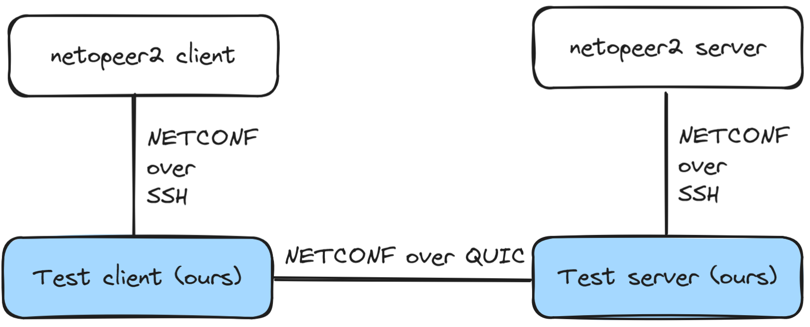

# NETCONF over Quinn

A command-line application to test NETCONF over QUIC. The name Quinn refers to Rust's community
implementation of the QUIC protocol, which we use in our code.

Note: this is meant as a PoC only, do not use it in production.

### Architecture

Instead of implementing a NETCONF client and server from scratch, we have created a bidirectional
proxy (see image below). This readme explains how to use the proxy together with netopeer2.



### Setting up netopeer2

Unfortunately, netopeer2 is cumbersome to compile and no binary releases are provided in the
official [repository](https://github.com/CESNET/netopeer2). We discovered Fedora offers netopeer2
through its package manager (`dnf install netopeer2`), so we set up a Fedora VM and used it for
testing. Using Docker should work too, so if you prefer that route do try it out (and submit a patch
so we can replace this manual setup).

After installing the netopeer2 package, we need to configure authorized clients. By default, the
netopeer2 server allows connections from clients with authorized keys in `.ssh/authorized_keys`. Our
_NETCONF over Quinn_ proxy uses `ssh_keys/client_rsa` when connecting to the netopeer2 server, so
you'll need to add its public key counterpart (e.g. `ssh-keygen -y -f ssh_keys/client_rsa`) to the
relevant `.ssh/authorized_keys` file in the Fedora VM. With that in place, you can start the server:
`systemctl start netopeer2-server`.

To test that everything is working properly, copy the SSH key from `ssh_keys/client_rsa` to a
directory inside the Fedora VM (e.g. to `~/.ssh/id_rsa` and `~/.ssh/id_rsa.pub`) and attempt to
connect through the netopeer2 client. The following excerpt of a command-line session shows a
successful connection:

```bash
$ netopeer2-cli
> status
Client is not connected to any NETCONF server.
> auth keys add .ssh/id_rsa.pub .ssh/id_rsa
> connect
> status
Current NETCONF session:
  ID          : 3
  Host        : 127.0.0.1
  Port        : 830
  Transport   : SSH
  Capabilities:
        urn:ietf:params:netconf:base:1.0
        urn:ietf:params:netconf:base:1.1
        <snip>
```

### Connecting through the QUIC proxy

Assuming that the netopeer2 server is running on port 830, you can start the client and server sides
of the NETCONF over QUIC proxy:

- `cargo run --release -- client`
- `cargo run --release -- server`

Now, instead of directly connecting to the netopeer2 server, you can use netopeer2-cli to connect to
the proxy client (which listens at `localhost:8081`):

```bash
$ netopeer2-cli
> connect --port 8081
> status
Current NETCONF session:
  ID          : 3
  Host        : 127.0.0.1
  Port        : 830
  Transport   : SSH
  Capabilities:
        urn:ietf:params:netconf:base:1.0
        urn:ietf:params:netconf:base:1.1
        <snip>
```

Note that our proxy accepts unauthenticated connections, which may pose a security risk, so make
sure the proxy is not accessible from the internet. We do this to simplify testing: as mentioned
above, the server end of the proxy authenticates with its own credentials (`ssh_keys/client_rsa`) to
the netopeer2-server.

### Acknowledgements

With special thanks to Marc Blanchet ([Viagénie inc.](https://www.viagenie.ca/)) for funding this
work.
